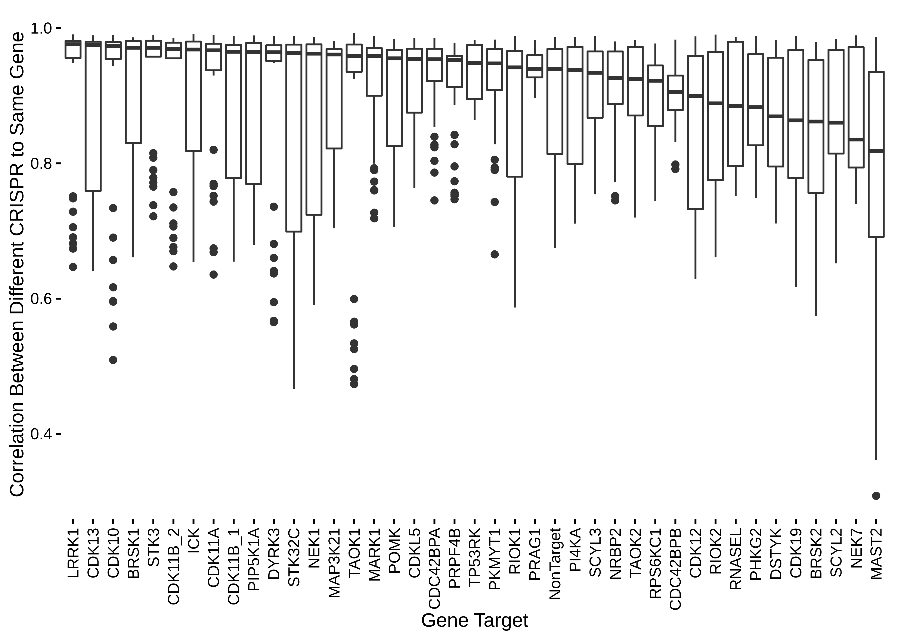
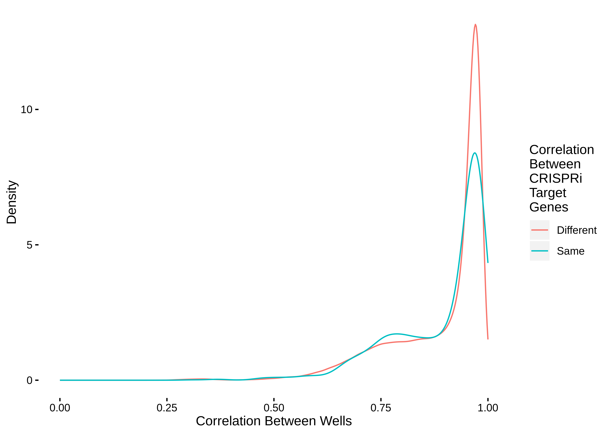
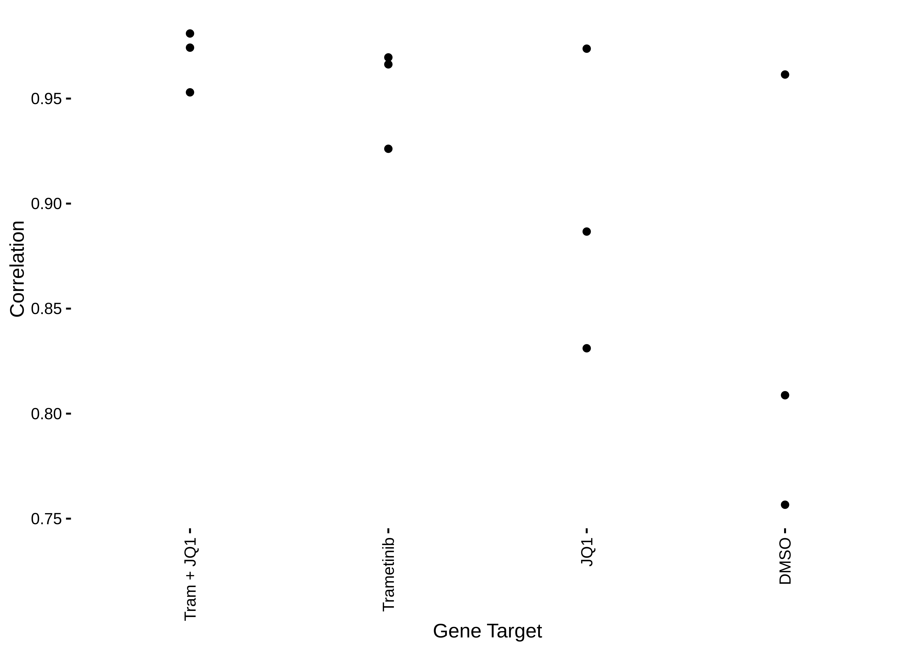
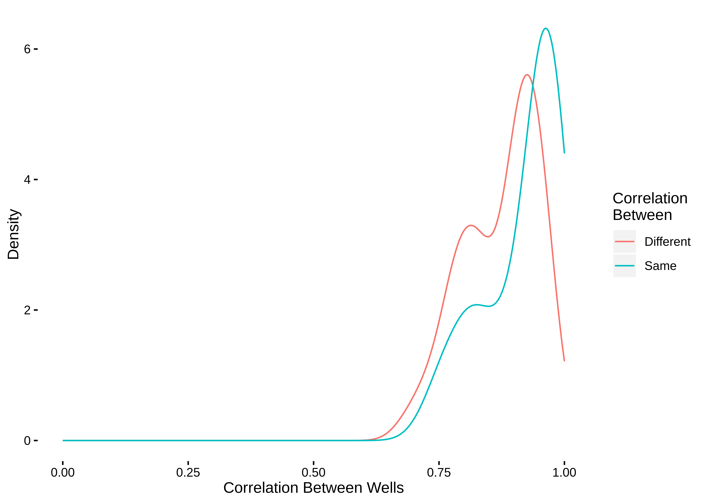
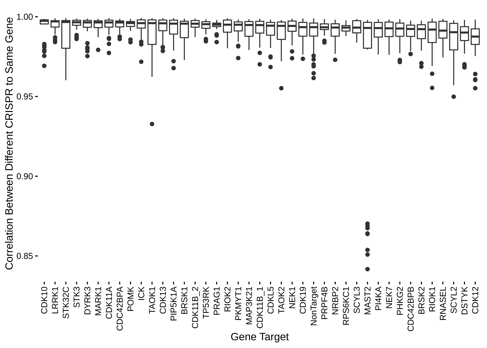
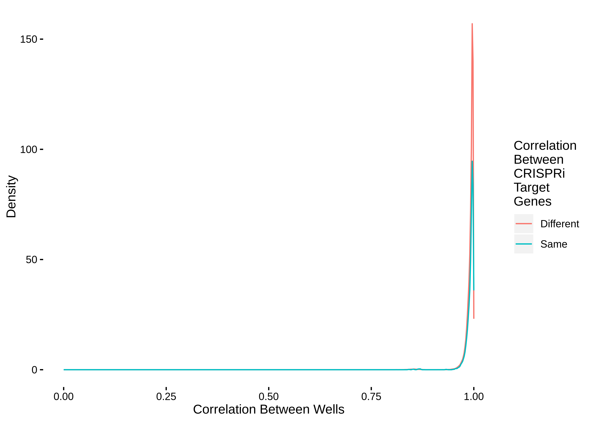

DGE-Seq Correlation Analysis
================
Matthew Berginski
March 1, 2019

``` r
library(tidyverse)
```

    ## ── Attaching packages ────────────────────────────────────────────────────────────────────────────────────────────────────────────── tidyverse 1.2.1 ──

    ## ✔ ggplot2 3.1.0     ✔ purrr   0.3.0
    ## ✔ tibble  2.0.1     ✔ dplyr   0.7.8
    ## ✔ tidyr   0.8.2     ✔ stringr 1.3.1
    ## ✔ readr   1.3.1     ✔ forcats 0.3.0

    ## ── Conflicts ───────────────────────────────────────────────────────────────────────────────────────────────────────────────── tidyverse_conflicts() ──
    ## ✖ dplyr::filter() masks stats::filter()
    ## ✖ dplyr::lag()    masks stats::lag()

``` r
library(here)
```

    ## here() starts at /home/mbergins/Documents/Projects/DGE_seq_analysis

``` r
library(readxl)
library(DarkKinaseTools)
require(purrr)
library(tictoc)
library(progress)
library(BerginskiRMisc)

knitr::opts_chunk$set(echo = TRUE, dpi=600, cache.lazy = T)
```

Data Processing/Loading
=======================

All the sequencing runs have been aligned to the human genome using salmon and the primary output file from this is the quant.sf file. All of these files are organized by well, so after reading in these files we'll also gather a map describing the plate layout and use that to map to the actual genes/drug perturbation.

``` r
tic()
if (file.exists(here('analysis_reports/Correlation/combined_salmon_quant.rds'))) {
  salmon_quant = read_rds(here('analysis_reports/Correlation/combined_salmon_quant.rds'))
} else {
  salmon_quant <- tibble(quant_file = list.files(path = '../../Sequencing_results/combined_sequencing/',
                                                 pattern='quant.sf',all.files = T,recursive = T)) %>%
    mutate(file_contents = map(quant_file,          
                               ~ suppressMessages(read_delim(file.path('../../Sequencing_results/combined_sequencing/',.),'\t'))) 
    )
  
  salmon_quant = as.data.frame(unnest(salmon_quant)) %>%
    select(-EffectiveLength,-Length) %>%
    mutate(well_id = stringr::str_match(basename(dirname(quant_file)),'(.*?).fastq.gz')[,2])
  
  salmon_quant = salmon_quant %>% 
    select(-quant_file)
}
toc()
```

    ## 25.968 sec elapsed

This excel file has the array layout and assocatied perturbations.

``` r
well_to_treatment = read_excel(here('Sequencing_results/MB_Array1_Layout.xlsx')) %>%
  dplyr::select(Dest384Well,Target) %>%
  mutate('well_letter' = str_extract(Dest384Well,'[[:alpha:]]'),
         'well_digit' = str_extract(Dest384Well,'[[:digit:]]{2}$')) %>%
  mutate('well_id' = paste0(well_letter,well_digit)) %>%
  dplyr::select(-Dest384Well,-well_letter,-well_digit)
```

    ## New names:
    ## * `` -> `..4`
    ## * `` -> `..5`
    ## * `` -> `..6`
    ## * `` -> `..7`
    ## * `` -> `..8`
    ## * … and 25 more

Now to actually calculate the correlation between the expression levels between all treatments.

``` r
#I'll spread the data back out into a wide matrix that will work with R's cor function
salmon_spread = salmon_quant %>% 
  select(Name,TPM,well_id) %>% 
  spread('well_id','TPM') %>% 
  select(-Name)

correlation_mat = cor(salmon_spread)
#block the lower triangle as all those are essentially repeated observations of
#the same correlations, plus the self correlations, which are all 1
correlation_mat[lower.tri(correlation_mat,diag=T)] = NA

#Now let's pull this correlation back into a tidy format for the plotting
correlation_tidy = as.data.frame(correlation_mat) %>% 
  rownames_to_column(var = "well_id_2") %>%
  gather('well_id_1','correlation',-well_id_2) %>%
  
  #This filter tosses all the lower triangle correlations that were set to NA
  filter(! is.na(correlation)) %>%
  
  #This a tricky use of joining to map out target treatment for both well_id_1
  #and well_id_2, between each join, I rename the Target column to differentiate
  #between the first and second join
  left_join(well_to_treatment,by=c('well_id_1'='well_id')) %>%
  rename(Target_1 = Target) %>%
  left_join(well_to_treatment,by=c('well_id_2'='well_id')) %>%
  rename(Target_2 = Target) %>%
  filter(!is.na(Target_1), !is.na(Target_2)) %>%
  
  #This checks both Target_1 and Target_2 for the drug treatments + related and
  #marks them as such
  mutate(is_drug_treatment = 
           ifelse(Target_1 %in% c("DMSO", "Trametinib", "JQ1", "Tram + JQ1") | 
                  Target_2 %in% c("DMSO", "Trametinib", "JQ1", "Tram + JQ1"),
                  TRUE,
                  FALSE)) %>%
    mutate(is_only_drug_treatment = 
           ifelse(Target_1 %in% c("DMSO", "Trametinib", "JQ1", "Tram + JQ1") & 
                  Target_2 %in% c("DMSO", "Trametinib", "JQ1", "Tram + JQ1"),
                  TRUE,
                  FALSE)) %>%
  #Now I'll add an indicator variable to indicate whether the targeted gene is
  #the same or different
  mutate(same_target = ifelse(Target_1 == Target_2,'Same','Different')) %>%
  identity()
```

Correlation Properties
----------------------

### Gene Perturbations

OK, with correlations calculated between each well, my first thought was to look at the correlations between CRISPR sequences that target the same gene. I'm hoping this will give an idea of how consistant the transcriptome changes are when hopefully the same gene is knocked down.

``` r
only_genes_same = correlation_tidy %>% filter(same_target == "Same", ! is_drug_treatment)

only_genes_same_median_cor = only_genes_same %>% 
  group_by(Target_1) %>%
  summarise(median_cor = median(correlation)) %>%
  arrange(desc(median_cor))

only_genes_same$Target_1 = factor(only_genes_same$Target_1, levels = only_genes_same_median_cor$Target_1)

ggplot(only_genes_same,aes(y=correlation,x=Target_1)) + 
  geom_boxplot() +
  theme_berginski() +
  theme(axis.text.x = element_text(angle = 90, hjust = 1, vjust=0.5)) +
  scale_x_discrete(breaks = only_genes_same_median_cor$Target_1) +
  labs(x="Gene Target",y="Correlation Between Different CRISPR to Same Gene") +
  NULL
```



Well then, I sort of expected the non-target guides to give the most consistant effects on transcription perturbation (ie no pertubation), but that doesn't quite look true. Many of the effects between a given set of guides targetting the same gene look somewhat similar.

Now to compare the correlation distributions between different gene perturbations.

``` r
only_genes_cor = correlation_tidy %>% filter(! is_drug_treatment)

ggplot(only_genes_cor, aes(x=correlation,color=same_target)) + 
  geom_freqpoly(stat="density") +
  xlim(c(0,1)) +
  labs(x="Correlation Between Wells",y="Density",color="Correlation\nBetween\nCRISPRi\nTarget\nGenes") +
  theme_berginski() +
  NULL
```



OK, this isn't great, the distribution of correlation values between the wells targetting different genes and the same gene look very similar.

### Drug Perturbations

There are substantially fewer drug treatments, so I've just made a quick dot plot to see the 3 comparisons for each treatment type.

``` r
only_drugs_same = correlation_tidy %>% filter(same_target == "Same", is_only_drug_treatment)

only_drugs_same_mean_cor = only_drugs_same %>% 
  group_by(Target_1) %>%
  summarise(average_cor = median(correlation)) %>%
  arrange(desc(average_cor))

only_drugs_same$Target_1 = factor(only_drugs_same$Target_1, levels = only_drugs_same_mean_cor$Target_1)

ggplot(only_drugs_same,aes(y=correlation,x=Target_1)) + 
  geom_point() +
  theme_berginski() +
  theme(axis.text.x = element_text(angle = 90, hjust = 1, vjust=0.5)) +
  scale_x_discrete(breaks = only_drugs_same_mean_cor$Target_1) +
  labs(x="Gene Target",y="Correlation") +
  NULL
```



Strangely enough, DMSO seems to have the lowest consistancy, but not not by much.

What about the distribution of drug treatment comparisons.

``` r
only_drugs_cor = correlation_tidy %>% filter(is_only_drug_treatment)

ggplot(only_drugs_cor, aes(x=correlation,color=same_target)) + 
  geom_freqpoly(stat="density") +
  xlim(c(0,1)) +
  labs(x="Correlation Between Wells",y="Density",color="Correlation\nBetween") +
  theme_berginski() +
  NULL
```



These two distributions don't look dramatically different either.

Gene Level Correlations
-----------------------

The last part was dealing with the raw transcript quantification files, maybe we'll see something different if we take the transcript level results and convert them to gene level counts?

``` r
ENST_to_HGNC = read_csv(here('ENST_to_HGNC.csv'))
```

    ## Parsed with column specification:
    ## cols(
    ##   ensembl_transcript_id_version = col_character(),
    ##   hgnc_symbol = col_character()
    ## )

``` r
salmon_hgnc_summary = salmon_quant %>% 
  left_join(ENST_to_HGNC, by=c('Name'='ensembl_transcript_id_version')) %>%
  group_by(hgnc_symbol,well_id) %>%
  summarise(total_TPM = sum(TPM)) %>%
  ungroup()
  
#I'll spread the data back out into a wide matrix that will work with R's cor function
salmon_spread = salmon_hgnc_summary %>%
  spread('well_id','total_TPM') %>%
  select(-hgnc_symbol)

correlation_hgnc_mat = cor(salmon_spread)
#block the lower triangle as all those are essentially repeated observations of
#the same correlations, plus the self correlations, which are all 1
correlation_hgnc_mat[lower.tri(correlation_hgnc_mat,diag=T)] = NA

#Now let's pull this correlation back into a tidy format for the plotting
correlation_hgnc_tidy = as.data.frame(correlation_hgnc_mat) %>%
  rownames_to_column(var = "well_id_2") %>%
  gather('well_id_1','correlation',-well_id_2) %>%

  #This filter tosses all the lower triangle correlations that were set to NA
  filter(! is.na(correlation)) %>%

  #This a tricky use of joining to map out target treatment for both well_id_1
  #and well_id_2, between each join, I rename the Target column to differentiate
  #between the first and second join
  left_join(well_to_treatment,by=c('well_id_1'='well_id')) %>%
  rename(Target_1 = Target) %>%
  left_join(well_to_treatment,by=c('well_id_2'='well_id')) %>%
  rename(Target_2 = Target) %>%
  filter(!is.na(Target_1), !is.na(Target_2)) %>%

  #This checks both Target_1 and Target_2 for the drug treatments + related and
  #marks them as such
  mutate(is_drug_treatment =
           ifelse(Target_1 %in% c("DMSO", "Trametinib", "JQ1", "Tram + JQ1") |
                  Target_2 %in% c("DMSO", "Trametinib", "JQ1", "Tram + JQ1"),
                  TRUE,
                  FALSE)) %>%
    mutate(is_only_drug_treatment =
           ifelse(Target_1 %in% c("DMSO", "Trametinib", "JQ1", "Tram + JQ1") &
                  Target_2 %in% c("DMSO", "Trametinib", "JQ1", "Tram + JQ1"),
                  TRUE,
                  FALSE)) %>%
  #Now I'll add an indicator variable to indicate whether the targeted gene is
  #the same or different
  mutate(same_target = ifelse(Target_1 == Target_2,'Same','Different')) %>%
  identity()
```

``` r
only_genes_same = correlation_hgnc_tidy %>% filter(same_target == "Same", ! is_drug_treatment)

only_genes_same_median_cor = only_genes_same %>% 
  group_by(Target_1) %>%
  summarise(median_cor = median(correlation)) %>%
  arrange(desc(median_cor))

only_genes_same$Target_1 = factor(only_genes_same$Target_1, levels = only_genes_same_median_cor$Target_1)

ggplot(only_genes_same,aes(y=correlation,x=Target_1)) + 
  geom_boxplot() +
  theme_berginski() +
  theme(axis.text.x = element_text(angle = 90, hjust = 1, vjust=0.5)) +
  scale_x_discrete(breaks = only_genes_same_median_cor$Target_1) +
  labs(x="Gene Target",y="Correlation Between Different CRISPR to Same Gene") +
  NULL
```



``` r
only_genes_cor = correlation_hgnc_tidy %>% filter(! is_drug_treatment)

ggplot(only_genes_cor, aes(x=correlation,color=same_target)) + 
  geom_freqpoly(stat="density") +
  xlim(c(0,1)) +
  labs(x="Correlation Between Wells",y="Density",color="Correlation\nBetween\nCRISPRi\nTarget\nGenes") +
  theme_berginski() +
  NULL
```



Well then,
